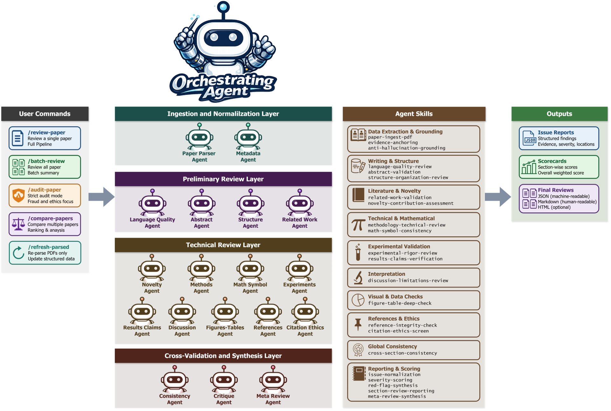

<div align="center">
  
  

  <h2>OpenReviewer: Automated Multi-Agent System for Evidence-Driven Research Paper Review and Integrity Auditing</h2>
  <!-- <h4>🌟 🌟</h4> -->

  <h4><i>The AI-powered pre-submission peer review layer for scientific research</i></h4>
  
  <br>
  
  <p>
    <a href="https://github.com/AliManjotho">Ali Asghar Manjotho</a><sup>1</sup>&nbsp;
  </p>

  <p>
    <sup>1</sup> Department of Computer Systems Engineering, Mehran Univerity of Engineering and Technology, Jamshoro, Pakistan &nbsp;&nbsp;
  </p>

<p align="center">
    
    
    
</p>

</div>




<br>

## 📌 Overview
Ever submitted a paper and faced rejection—without clear, actionable feedback?
What if you had access to a team of expert reviewers before submission, helping you identify weaknesses, validate claims, and strengthen your manuscript?

**Meet OpenReviewer.**

OpenReviewer is an advanced **multi-agent AI system** built to deliver **pre-submission**, **evidence-driven research paper reviews at scale**.

It orchestrates a team of specialized AI agents to analyze manuscripts across **language quality**, **methodology**, **experiments**, **citations**, and **cross-section consistency—producing transparent**, **explainable**, and **reproducible review reports** that help you improve your work before it reaches reviewers.

<br>

## 📰 News
- 🎉 **v1.0 Released**  
  Initial release of OpenReviewer with:
  - Multi-agent orchestration pipeline  
  - Structured review generation  
  - Citation integrity checks  
  - Cross-section consistency validation  
  - Scorecards and issue reports
 
## 🧠 Architecture Overview
- **Orchestrating Agent** controls the full pipeline  
- Multiple **specialized sub-agents** handle domain-specific analysis  
- Outputs include:
  - Issue Reports
  - Scorecards
  - Final Structured Reviews 

## 🤖 Agents

### 🔴 Primary Agent

| Agent Name | Description |
|-----------|------------|
| Orchestrating Agent | Controls workflow, dispatches sub-agents, aggregates outputs |


### 🟣 Sub Agents

| Sub Agent | Responsibility |
|----------|--------------|
| Paper Parser Agent | Extracts structured content from PDFs |
| Metadata Agent | Extracts authors, affiliations, references |
| Language Quality Agent | Grammar, spelling, readability |
| Abstract Agent | Abstract validation |
| Structure Agent | Section organization analysis |
| Related Work Agent | Literature relevance and correctness |
| Novelty Agent | Contribution and novelty assessment |
| Methods Agent | Methodology validation |
| Math & Symbol Agent | Equation and symbol consistency |
| Experiments Agent | Experimental setup validation |
| Results Claims Agent | Results correctness and claim validation |
| Discussion Agent | Interpretation and limitation checks |
| Figures & Tables Agent | Visual and caption validation |
| References Agent | Reference validation |
| Citation Ethics Agent | Citation bias, retractions, PubPeer checks |
| Consistency Agent | Cross-section consistency |
| Critique Agent | Weakness detection |
| Meta Review Agent | Final synthesis |


## 🧩 Skills

| Skill Category | Skills |
|---------------|-------|
| Data Extraction & Grounding | paper-ingest-pdf, evidence-anchoring, anti-hallucination-grounding |
| Writing & Structure | language-quality-review, abstract-validation, structure-organization-review |
| Literature & Novelty | related-work-validation, novelty-contribution-assessment |
| Technical & Mathematical | methodology-technical-review, math-symbol-consistency |
| Experimental Validation | experimental-rigor-review, results-claims-verification |
| Interpretation | discussion-limitations-review |
| Visual & Data Checks | figure-table-deep-check |
| References & Ethics | reference-integrity-check, citation-ethics-screen |
| Global Consistency | cross-section-consistency |
| Reporting & Scoring | issue-normalization, severity-scoring, meta-review-synthesis |


## ⚙️ Commands

| Command | Description |
|--------|------------|
| `/review-paper` | Review a single paper using full pipeline |
| `/batch-review` | Review multiple papers and generate summary |
| `/audit-paper` | Perform strict integrity and fraud detection audit |
| `/compare-papers` | Compare multiple papers and rank them |
| `/refresh-parsed` | Re-parse PDFs and update structured data |


## 🛠️ Installation
### 1. Install and configure <code>OpenCode</code>
You must first install and configure OpenCode. Follow the instructions in <a href="./assets/opencode.pdf">opencode.pdf</a>


1.1 Download and install curl by vising the following link:
```
https://curl.se/
```
1.2 Extract the folder in C:\
1.3 Rename the folder to <code>curl</code>

1.4 Add <code>curl</code> bin path in <code>PATH</code> environment variable:
```
C:\curl\bin
```
1.5 Visit the following link to download and install git:
```
https://git-scm.com/
```
1.6 Open command prompt and run:
```
wsl --install
```
1.7 Open <code>git bash</code> from start menu and run the following command:
```
curl -fsSL https://opencode.ai/install | bash
```
1.8 Add opencode path in <code>PATH</code> environment variable:
```
C:\Users\Ali\.opencode\bin
```
Change <code>Ali</code> with your own system username

### 2. Install OpenReviewer
```bash
https://github.com/AliManjotho/open-reviewer.git
cd open-reviewer
opencode
```


## 📊 Outputs
 -📄 Issue Reports
  -Structured findings with severity levels
 -📈 Scorecards
  -Section-wise and overall evaluation
 -🧾 Final Reviews
  -JSON (machine-readable)
  -Markdown (human-readable)
  -HTML (optional)

## 🧠 Key Features
✅ Multi-agent orchestration
✅ Evidence-driven validation
✅ Citation integrity auditing
✅ Cross-section consistency analysis
✅ Explainable outputs with traceability


## 📜 License

MIT License

## ⭐ Support

If you find this project useful, please ⭐ the repo!

